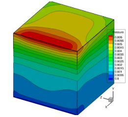
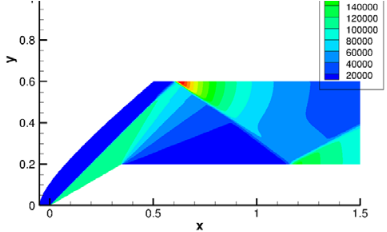
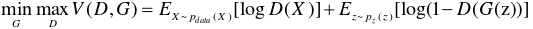
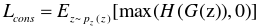
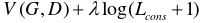
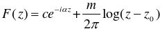
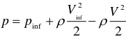
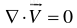
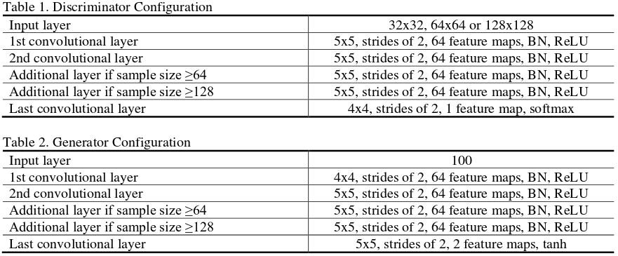

# CS5824_Team6 (Title: Physics-informed GANs in Computational Fluid Dynamics)
This is the GitHub repository for the CS5824 19Fall course project (Team6: Weicheng Xue and Richard Tan). The project is aimed to 1) reproduce the results in the paper titled "Physics-Informed Generative Adversarial Networks by Incorporating Conservation Laws" [1], 2) evaluate the findings by running the code and comparing the results we get to the results in Ref [1], 3) reinforce our study of the principles of how GANs [2] work or specifically how physics-informed GANs [2,3] can be applied in the Computational Fluid Dynamics (CFD) field.

[1] Zeng, Yang, Jinlong Wu, and Heng Xiao. "Physics-Informed Generative Adversarial Networks by Incorporating Conservation Laws." Bulletin of the American Physical Society 63 (2018).

[2] Goodfellow, Ian, et al. "Generative adversarial nets." Advances in neural information processing systems. 2014.

[3] Xie, You, et al. "tempogan: A temporally coherent, volumetric gan for super-resolution fluid flow." ACM Transactions on Graphics (TOG) 37.4 (2018): 95.

# Background
Traditional Computational Fluid Dynamics (CFD) methods are commonly computationally expensive in solving a system of Partial Differential Equations (PDEs) on well refined grid meshes, especially for turbulent flows and high Reynolds number flows. To generate the numerical solutions, we usually need to iteratively solve a system of nonlinear partial differential equations. Iteratively solving these equations can be computationally expensive, therefore researchers in the CFD area have been thinking about cheaper ways to generate numerical solutions with high accuracy faster. Attached figures are some traditional CFD applications (results from our own research). Fortunately, the development of machine learning (ML) or deep learning (DL) technique provides us with a completely innovated way to generate solutions for some fluid dynamics problems in hours, or even in minutes. This is a multi-disciplinary field which has already aroused a lot of interestes from the areas of Aerospace Engineering and Data Sciences. As Aerospace Engineers, the ultimate goal of such research is to solve general CFD problems numerically using ML techniques such as physics-informed GANs, as they may be computationally cheaper than the traditional CFD methods.

Having the capability of generating false data, the generative adversarial networks (GANs) have been regarded as one of the most promising deep learning methods. GANs is composed of two neural networks, one of which is generative neural network and the other is discriminative neural network so that the two neural networks can compete with each other to generate some false data which mimic the true data. GANs seems promising but there may be some serious issues when applying GANs to physical problems. The first issue is that the generated data by GANs may not satisfy physical conservation laws or constraints due to its poor ability (maybe more related to the reliability as Aerospace Engineers may not trust the results from using GANs) to extract complex physical features correctly. The second issue is that the training process may become more difficult and time-consuming to converge after adding some physical constraints to the model.

Ref [1] is about using a physics-informed GANs model (PI-GANs) to simulate a family of potential flows (uniform flow + source flow). In PI-GANs, physical information such as the mass conservation law (for an incompressible flow) is integrated to GANs as a penalty term. This penalty term embedded to the generator to enforce the generated data inform the physical information. Although the flow itself studied in this project is elementary, the goal of this project is to see whether this PI-GANs can generate some “true” flows that mimic the real flows satisfying physical constraints, and it is a good start for future work on more complicated flows.

# A Summary of Ref [1]

## What have been Reproduced in this Course Project?
Ref [1] can be summarized into four sections logically. the first section deals with the theory and evolution of various GANs models. General GANs such as the first GANs model in Ref [2] are introduced first, followed by specific GANs including WGANs and physcis-informed GANs used in Ref[1]. Another paper [3] discussing the application of GANs into the CDF area is also referenced for better understanding. The second section deals with a simple test case of generating circles with geometrical constraints. The application in this section is very simple, thus it is not a focus of our project. The third section deals with applying a physics-informed GANs model to simulate a simple potential flow, which is the most interested part to us. The code in Ref [1] can be found here: https://github.com/zengyang7/Parallel-PIGANs. We reproduced many results to the third section and also tried something not mentioned in Ref [1], such as removing less pixel points around the singularity of the potential flows. The last section is mainly about conclusions. We verified those conclusions but have a major doubt, that is, whether the physics-informed GANs can be applied for flows with discontinuity and large gradients, which are not mentioned in Ref [1].

## Theory
Goodfellow et al. [2] firstly proposed GANs in 2014. The objective function of GANs used in their work was given as:

where G and D are generator and discriminator, respectively, z the latent variables which are sampled from a given distribution pz(z) such as a uniform and Gaussian distribution, X the given training samples, pdata(X) the distribution of these training samples.

Physical constraints can be usually denoted as H(X)<=0, where H can be a system of differential equations or more complex physical constraints. To evaluate whether the generated data of GANS satisfies some physical constraints, the constaint term is included in a loss function term given as:

The constraints can be integrated into the loss function of GANS through:

where $\lambda$ is a tunning factor, of which the effect is investigated in Ref [1].

## Generating Training Data Samples
The data are generated by analytically solving the velocity field which is a superposition of two kinds of potential flows: uniform and source flow, and then solving the Bournoulli’s equation to get the pressure filed. In Ref [1], the PI-GANS model can be trained on the velocity (velocity is a vector) field data and pressure field data simultaneously (or only train on the velocity field data but less precisely). The velocity field of the flow is given by a complex potential function

where z=x+iy, c determining the magnitude of velocity and α the flow direction angle of the uniform flow, m the strength of the source flow, z_0 the position of the source. Using Bournoulli’s equation, the pressure field can be easily computed

The physical constraint used in Ref [1] is that the divergence of the velocity field should be 0 for an impressible flow, that is,

There are some parameters which need to be defined for the training samples. The parameters c, α and m are sampled from independent Gaussian distribution c~N(4, 0.4), α~N(0, π/4 ) and m~N(1, 0.2) to generate the velocity field and pressure field for 20000 samples (a sample is an image). Cartesian grids with grid mesh sizes of 32x32, 64x64 and 128x128 are all generated, but only the 32x32 samples are trained in Ref [1]. Input samples are normalized and compressed into [-1, 1]. 

To generate the data samples, run using "python write_tfrecord.py". You can change the grid mesh size, but you should also change the network size, the convolution kernel size and the strides in the "Serial_PIGANs_PF_dataset.py" (however, you do not need to do so for 32x32 to 512x512 grids as these are considered in the source code). This file also has a normalization so that the train data can be normalized.

## Models
The configurations of the generator and discriminator used in Ref [1] can be found in the following tables. Since Ref [1] only runs the 32x32 size samples, this project also does the similar thing (for other sizes of data, conclusions should not be affected greatly).

## Results

# How to Run the Code
You need to have a GPU to run the code to save time as this code can be slow on the GPU. If you are a VT faculty/student, you may need to apply for an allocation on the ARC system including NewRiver, CasCades and HuckleBerry. If you have allocation there already, then please follow the steps below.

## Step 1
Login to a cluster first. For example, if you want to acesss NewRiver, try

ssh -X your_PID@newriver1.arc.vt.edu

You need to replace "your_PID" with your actual PID. For me, I use "ssh -X weich97@newriver1.arc.vt.edu".

After you do this, VT requires your password to your account and you also need to push your DUO to allow the access.

For the Huckleberry, please try

ssh -X your_PID@huckleberry1.arc.vt.edu

## Step 2
Then you need to apply a node with a certain number of CPU cores and GPUs for a period of time. On NewRiver, try

qsub -I -lnodes=1:ppn=2:gpus=2 -q p100_normal_q -l walltime=04:00:00 -W group_list=newriver -A your_allocation_name

This statement means that a node with 2 CPU cores and 2 GPUs is applied for 4 hours. You need to replace "your_allocation_name" with the actual allocation name you have and make sure you are added into that allocation. Our group's allocation name is "vt_aoe_dl", i.e.,

qsub -I -lnodes=1:ppn=2:gpus=2 -q p100_normal_q -l walltime=04:00:00 -W group_list=newriver -A vt_aoe_dl

If you want to access HuckleBerry, please try

salloc --time=04:00:00 -N 1 -n 8 --gres=gpu:2 --partition=normal_q --account=vt_aoe_dl

## Step 3
Then you need to load some modules and activate the Anaconda environment on the nodes you applied. On NewRiver, try

module load Anaconda/5.1.0

module load cuda/9.0.176

module load cudnn/7.1

If you are using Huckleberry instead, please try

module load gcc cuda Anaconda3 jdk

source activate powerai16_ibm

## Step 4
Finally you can run the code. cd to the directory where you store the code and the data, and try

python Serial_PIGANs_PF_dataset.py

You may need to understand the code first so that you can make some modifications.

# Results

# Conclusions

# Some Important Notes
The original source code can be found at git@github.com:zengyang7/Parallel-PIGANs.git. The source code may be used but requires citing:

[1] Zeng, Yang, Jinlong Wu, and Heng Xiao. "Physics-Informed Generative Adversarial Networks by Incorporating Conservation Laws." Bulletin of the American Physical Society 63 (2018).

The code on this project is modified based on the code in Ref [1]. If there is any question about running the code in this repository, please email weich@vt.edu. If there are other questions (such as requesting the paper), please e-mail the author in Ref [1]. Thanks!
