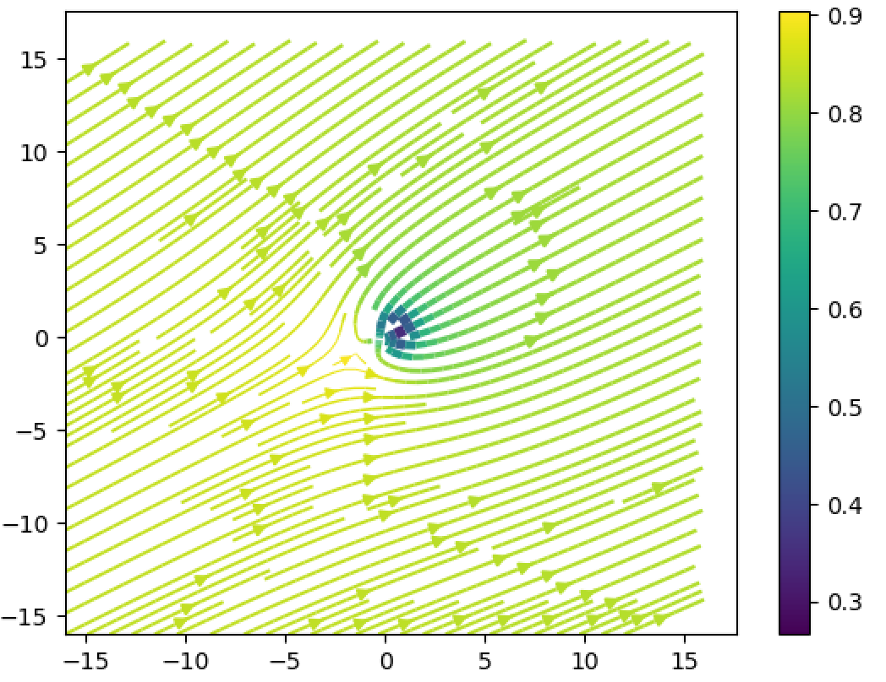
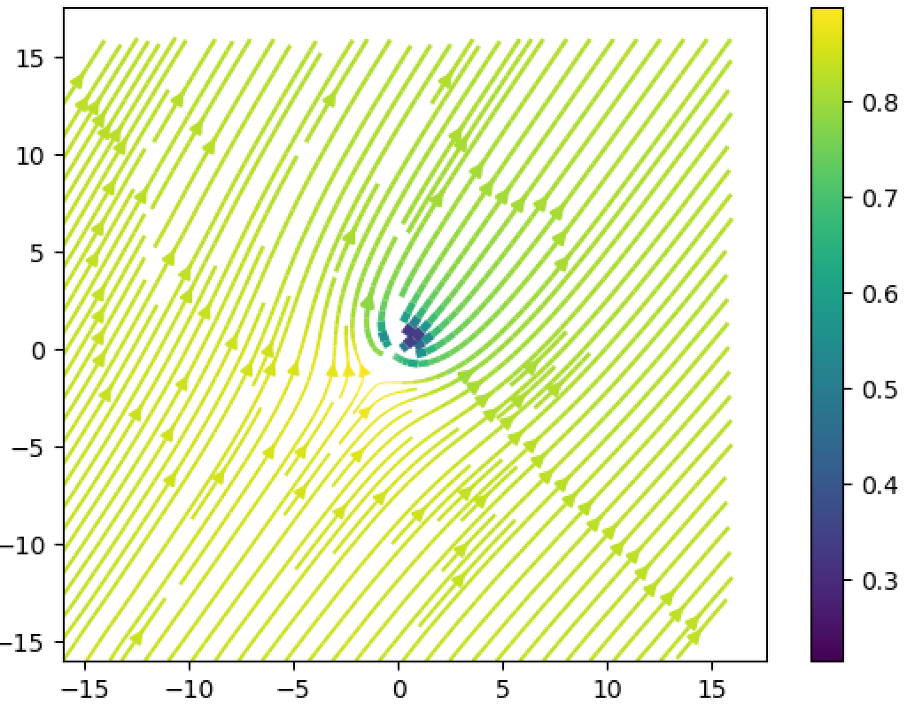
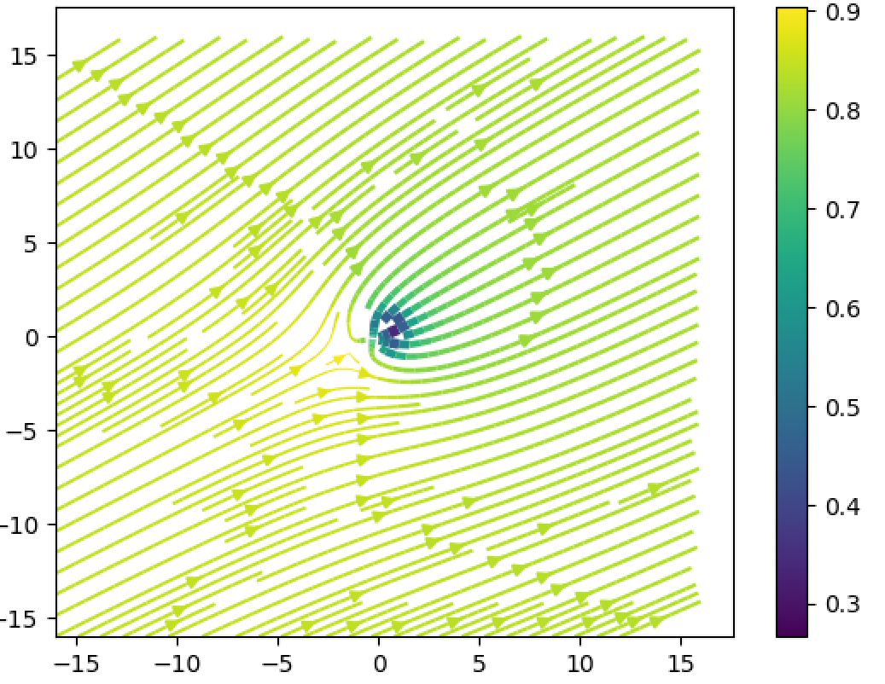
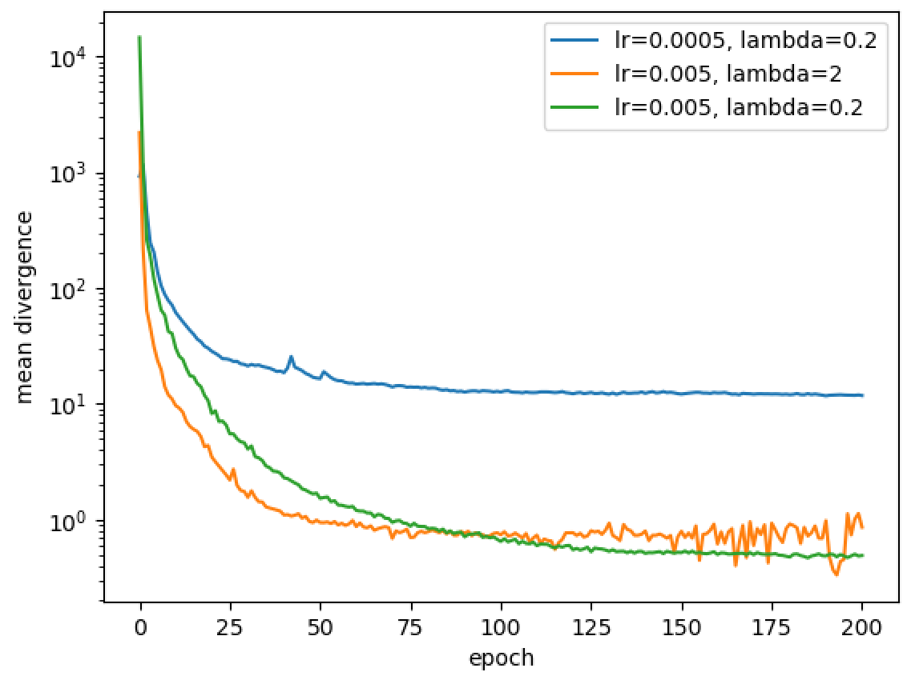

# CS5824_Team6 (Title: Physics-informed GANs in Computational Fluid Dynamics)
This is the GitHub repository for the CS5824 19Fall course project (Team6: Weicheng Xue and Richard Tan). The project is aimed to:

1. Reproduce the results in the paper titled "Physics-Informed Generative Adversarial Networks by Incorporating Conservation Laws" [1],
2. Evaluate the findings by running the code and comparing our results to the results in Ref [1], and 
3. Reinforce our study of the principles of how GANs [2] work, specifically how physics-informed GANs [2,3] can be applied in the Computational Fluid Dynamics (CFD) field

### References
[1] Zeng, Yang, Jinlong Wu, and Heng Xiao. "Physics-Informed Generative Adversarial Networks by Incorporating Conservation Laws." Bulletin of the American Physical Society 63 (2018).

[2] Goodfellow, Ian, et al. "Generative adversarial nets." Advances in neural information processing systems. 2014.

[3] Xie, You, et al. "tempogan: A temporally coherent, volumetric gan for super-resolution fluid flow." ACM Transactions on Graphics (TOG) 37.4 (2018): 95.

# Background
Traditional Computational Fluid Dynamics (CFD) methods involve solving a system of Partial Differential Equations (PDEs) on well-refined grid meshes, especially for turbulent and high Reynolds number flows. To generate the numerical solutions, we typically need to iteratively solve a system of nonlinear partial differential equations. 

However, iteratively solving these equations can be computationally expensive. Therefore researchers in the CFD area have been thinking about cheaper ways to generate numerical solutions with high accuracy faster. Below are figures of some traditional CFD applications (results from our own research).

A 3D LDC problem            |  A 2D supersonic inlet problem
:--------------------------:|:-------------------------:
  |  

Fortunately, the development of machine learning (ML) or deep learning (DL) technique provides us with a completely innovated way to generate solutions for some fluid dynamics problems in hours, or even in minutes. This is a multi-disciplinary field which has already aroused a lot of interestes from the areas of Aerospace Engineering and Data Sciences. As Aerospace Engineers, the ultimate goal of such research is to solve general CFD problems numerically using ML techniques such as physics-informed GANs, as they may be computationally cheaper than the traditional CFD methods.

Having the capability of generating false data, the generative adversarial networks (GANs) have been regarded as one of the most promising deep learning methods. GANs are composed of two neural networks, one of which is generative neural network and the other is discriminative neural network so that the two neural networks can compete with each other to generate some false data which mimic the true data. 

GANs may seem promising, but there may be some serious issues when applying GANs to physical problems:

1. Generated data by GANs may not satisfy physical conservation laws or constraints due to its poor capability (maybe more related to the reliability as Aerospace Engineers may not trust the results from using GANs) to extract complex physical features correctly. 
2. The training process may become more difficult and time-consuming to converge after adding some physical constraints to the model.

Ref [1] is about using a physics-informed GANs model (PI-GANs) to simulate a family of potential flows (uniform flow + source flow). In PI-GANs, physical information such as the mass conservation law (for an incompressible flow) is integrated to GANs as a penalty term. This penalty term embedded to the generator can make the generated data to satisfy some physical constraints. Although the flow itself studied in this project is elementary, the goal of this project is to see whether this PI-GANs can generate some “true” flows that mimic the real flows satisfying physical constraints, and it is a good start for future work on more complicated flows.

# A Summary of Ref [1]

## What have been Reproduced in this Course Project?
The first section of Ref [1] deals with the theory and evolution of various GANs models. General GANs such as the first GANs model in Ref [2] are introduced first, followed by specific GANs including WGANs and physcis-informed GANs used in Ref[1]. Another paper [3] discussing the application of GANs into the CDF area is also referenced to enable use a better understanding of GANs. 

The second section deals with a simple test case of generating circles with geometrical constraints. The application in this section is very simple, thus it is not a focus of our project. 

The third section deals with applying a physics-informed GANs model to simulate a simple potential flow, which is the most interested part to us. The code in Ref [1] can be found here: https://github.com/zengyang7/Parallel-PIGANs. We reproduced many results to the third section and also tried something not mentioned in Ref [1], such as removing less pixel points around the singularity of the potential flows. 

The last section in Ref [1] is mainly about conclusions. We verified those conclusions but have two major doubts:

1. whether the physics-informed GANs can be applied for flows with discontinuity and large gradients, which are not mentioned in Ref [1].
2. whether the physics-informed GANs can be truly used to reproduce the results from the tradional CFD methods.

## Theory
Goodfellow et al. [2] firstly proposed GANs in 2014. The objective function of GANs used in their work was given as:


where G and D are generator and discriminator, respectively, z the latent variables which are sampled from a given distribution p<sub>z</sub>(z) such as a uniform and Gaussian distribution, X the given training samples, p<sub>data</sub>(X) the distribution of these training samples.

Physical constraints can be usually denoted as H(X)<=0, where H can be a system of differential equations or more complex physical constraints. To evaluate whether the generated data of GANS satisfies some physical constraints, the constaint term is included in a loss function term given as:


The constraints can be integrated into the loss function of GANS through:


where $\lambda$ is a tunning factor, of which the effect is investigated in Ref [1].

## Generating Training Data Samples
The data are generated by analytically solving the velocity field which is a superposition of two kinds of potential flows: uniform and source flow, and then solving the Bournoulli’s equation to get the pressure filed. In Ref [1], the PI-GANS model can be trained on the velocity (velocity is a vector) field data and pressure field data simultaneously (or only train on the velocity field data but less precisely). The velocity field of the flow is given by a complex potential function


where z=x+iy, c determining the magnitude of velocity and α the flow direction angle of the uniform flow, m the strength of the source flow, z_0 the position of the source. Using Bournoulli’s equation, the pressure field can be easily computed


The physical constraint used in Ref [1] is that the divergence of the velocity field should be 0 for an impressible flow, that is,


There are some parameters which need to be defined for the training samples. The parameters c, α and m are sampled from independent Gaussian distribution c~N(4, 0.4), α~N(0, π/4 ) and m~N(1, 0.2) to generate the velocity field and pressure field for 20000 samples (a sample is an image). Cartesian grids with grid mesh sizes of 32x32, 64x64 and 128x128 are all generated, but only the 32x32 samples are trained in Ref [1]. Input samples are normalized and compressed into [-1, 1]. 

To generate the data samples, run using "python write_tfrecord.py". You can change the grid mesh size, but you should also change the network size, the convolution kernel size and the strides in the "Serial_PIGANs_PF_dataset.py" (however, you do not need to do so for 32x32 to 512x512 grids as these are considered in the source code). This file also has a normalization so that the train data can be normalized.

## Models
The configurations of the generator and discriminator used in Ref [1] can be found in the following tables. Since Ref [1] only runs the 32x32 size samples, this project also does the similar thing (for other sizes of data, conclusions should not be affected greatly).


## Results in Ref [1]

### Velocity Contours
The following figures show a training data sample and a prediction data sample, respectively. The velocity field contour of the training data sample is very smooth every well except at the singularity location (the center). However, this training data sample is not compared directly to the prediction data sample in Ref [1]. We are not sure of why the paper uses such a way to present the results. Recall that the training data is a family of flows. If we only look at the velocity countour and streamlines, the GANs model generate a reasonable flow field for such a problem, but there is no way to know what parameters these results are for (we do not know the strength, the exact direction of uniform flow, etc. so we do not know what family member these prediction results are for). 

Training Sample            |  Prediction Sample
:-------------------------:|:-------------------------:
  |  

We think a better way to compare whether the results are good or not is to compare the true data with the false data generated by GANs from a same distribution (using the same Gaussian noise vector). We did it in our project and modified the relevant portion of the original code.

### Velocity Divergence History
The following figure shows the effect of the tuning factor lambda over the convergence. A moderate value of lambda is preferred as it makes the convergence faster and better. Here using lambda=0 means that a standard GANs is used (no constraints enforced). The standard GANs is not used in this project.


# How to Run the Code
You need to have a GPU to run the code to save time as this code can be slow on the CPU, especially for a large dataset. If you are a VT faculty/student, you may need to apply for an allocation on the ARC system including NewRiver, CasCades and HuckleBerry. If you have allocation there already, then please follow the steps below.

## Python Packages Required
Tensorflow, numpy, math, matplotlib, etc.

## Step 1
Login to a cluster first. For example, if you want to acesss NewRiver, try

```
ssh -X your_PID@newriver1.arc.vt.edu
```

You need to replace `your_PID` with your actual PID. For me, I use "ssh -X weich97@newriver1.arc.vt.edu".

After you do this, VT requires your password to your account and you also need to push your DUO to allow the access.

For the Huckleberry, please try

```
ssh -X your_PID@huckleberry1.arc.vt.edu
```

## Step 2
Then you need to apply a node with a certain number of CPU cores and GPUs for a period of time. On NewRiver, try

```
qsub -I -lnodes=1:ppn=2:gpus=2 -q p100_normal_q -l walltime=04:00:00 -W group_list=newriver -A your_allocation_name
```

This statement means that a node with 2 CPU cores and 2 GPUs is applied for 4 hours. You need to replace `your_allocation_name` with the actual allocation name you have and make sure you are added into that allocation. Our group's allocation name is `vt_aoe_dl`, i.e.,

```
qsub -I -lnodes=1:ppn=2:gpus=2 -q p100_normal_q -l walltime=04:00:00 -W group_list=newriver -A vt_aoe_dl
```

If you want to access HuckleBerry, please try

```
salloc --time=04:00:00 -N 1 -n 8 --gres=gpu:2 --partition=normal_q --account=vt_aoe_dl
```

## Step 3
Then you need to load some modules and activate the Anaconda environment on the nodes you applied. On NewRiver, try

```
module load Anaconda/5.1.0 
module load cuda/9.0.176 
module load cudnn/7.1
```


If you are using Huckleberry instead, please try

```
module load gcc cuda Anaconda3 jdk
source activate powerai16_ibm
```

## Step 4
Finally you can run the code. cd to the directory where you store the code and the data, and try

```
python Serial_PIGANs_PF_dataset.py
```

You may need to understand the code first so that you can make some modifications.

# Our Results

## Contour Plots
Attached contour comparisons are not given in the paper but we think it would be meaninful to present. After we finish training, we get the trained model. We can then use the trained model to validate a sample in the training dataset. If the prediction is very close to the original true sample, we would think the model is good enough, otherwise it means that the trained model may not reproduce the original CFD results well. Also, we want to investigate the effect of removing different numbers of pixel points near the sigularity on the training, as this flow problem has a singularity at the center of the domain shown.

First, we found that the GANs model CANNOT reproduce the original data, although the velocity and pressure field looks reasonable. The solutions generated by the GANs model are close to physical solutions because the mean divergence is very close to 0. However, under what conditions (flow mass rate, velocity direction, etc.) the solutions are generated are unclear, becasue the velocity directions on the training sample and the prediction sample are clearly different based on our results. Similar Results are not given and discussed in Ref [1] out of some reasons. Actually, the traditional CFD method solve a problem under a given condition, but the physics-informed GANs cannot do the work that way (based on our reproduced results). 

Seceond, if removing more data points near the sinularity, then the contour plots becomes quite different, possibly due to the slow convergence. However, a more important reason may be that the GANs cannot deal with large gradients in the data very well. The authors in Ref [1] did not mention this. We guess that the large gradient may be a difficulty for the GANs model or the physics-informed GANs model (based on our reproduced results). 

### Results with 21.8% data points near the singularity removed:

Training Sample            |  Prediction Sample
:-------------------------:|:-------------------------:
  |  

### Results with 9.38% data points near the singularity removed:

Training Sample            |  Prediction Sample
:-------------------------:|:-------------------------:
  |  

## Divergence History of the Velocity Field
The following figures show the effect of the learning rate and the turning factor lambda on the convergence rate. It can clearly seen that a higher learning rate (lr=0.005) is better as it converges much faster than using a lower learning rate (lr=0.0005), which is consistent with the results in Ref [1]. However, a larger lambda makes the training more unstable compared to using a smaller lambda. Higher lambda means the effect of constraint is stronger. We understand that the iterating would be more unstable in the initial transition stage, but we are unsure of why the iterating is still not very stable when the training is close to the convergence. This was also happend in Ref [1] and explained in a way that the two terms in the loss function should be balanced to get a better convergence, even if the convergence is close to the tolerance. Our reproduced results here are very similar to the results in Ref [1].

Also, if we remove more points near the singularity, then the case cannot be converged well. The final mean divergence is still higher than 100 and cannot be driven down further. This indicates that the physcis-informed GANs cannot be used to train problems with large gradients, which is consistent with what we found in the countour plots section. This is also not specified in Ref [1].

Different lr and lambda  |  Removing points near the singularity
:-----------------------:|:-------------------------:
  |  

# Our Conclusions

After finishing the project, we can basically reproduce the results in Ref [1] (not exactly the same, but very similar). However, Ref[1] did not validate their results after training the model, so we think it is not convincing to show that the physics-informed GANs can be used to reproduce the results generated by using the traditional CFD methods. Also, Ref [1] used a trick of making their results better by removing about 21.8 of the pixel points near the singularity in the code (but did not explicitly mentioned in the paper). After removing less pixel points near the singularity (9.38%), we found that the convergence history becomes unexpected and much worse. The results also become worse. This indicates that the physics-informed GANs model in Ref [1] may not deal with fluid problems having large gradients or discontinuities. Large gradeint exist normally in boundary layer flow problems and discontinuities exsit normally in high-speed flow problems. For such problems, the physics-informed GANs model need to be improved.

# Some Important Notes
The original source code can be found at git@github.com:zengyang7/Parallel-PIGANs.git. The source code may be used but requires citing:

Zeng, Yang, Jinlong Wu, and Heng Xiao. "Physics-Informed Generative Adversarial Networks by Incorporating Conservation Laws." Bulletin of the American Physical Society 63 (2018).

The code on this project is modified based on the code in Ref [1]. If there is any question about running the code in this repository, please email weich@vt.edu. If there are other questions (such as requesting the paper), please e-mail the author in Ref [1]. Thanks!
